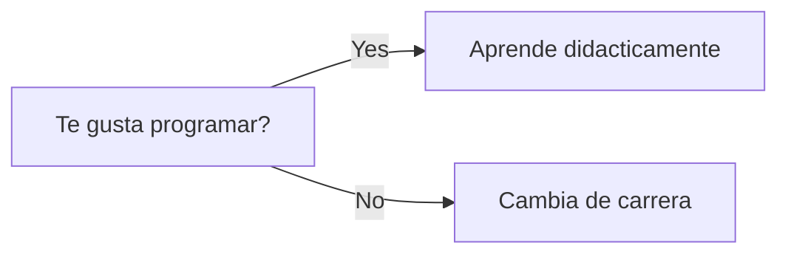

# Welcome
Bienvenido al juego gato o tambien conocido como tres en raya

>En esta parte te mostraremos como se desarrollo el programa :D

{style="note"}

## Tecnologia utilizada
Para realizar el programa que estas apunto de ver es necesario conocer que fue desarrollado con 
diferentes tecnologias que se utilizan en ReactJS sin nungun tipo de propiedades CSS para
dar estilo a estos.

| Elemento  | Uso                                               |
|-----------|---------------------------------------------------|
| UseState  | Cambio  y/o almacenamiento de estados             |
| UseEffect | Ejecucion de elementos de codigo segun se indique |

## Visualización del programa final

{border-effect="rounded" thumbnail="true" width="300"}

## Pasos para el desarrollo

